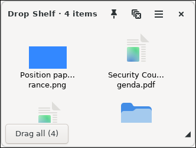
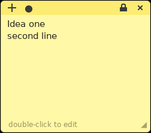
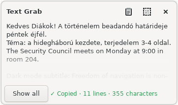
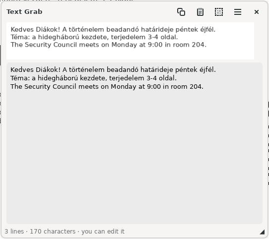
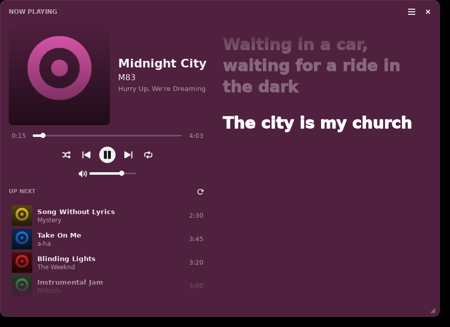
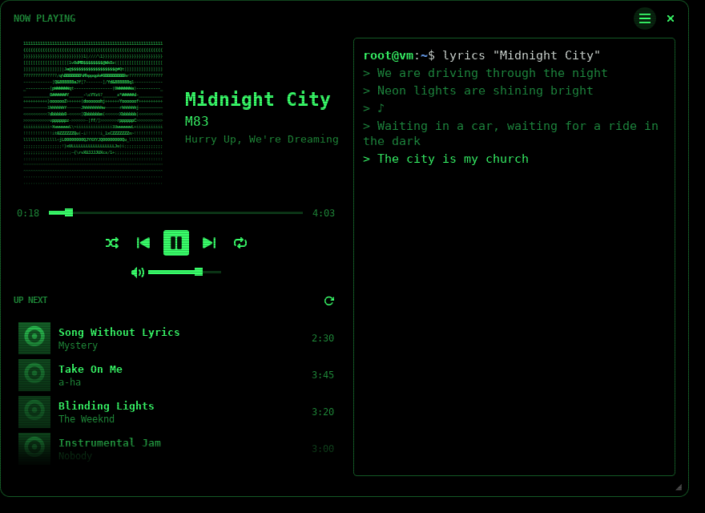
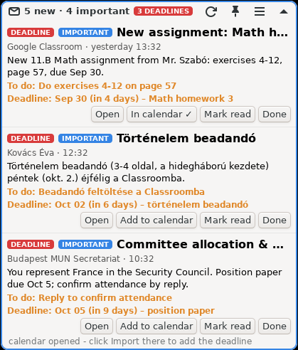

# Mint Desktop Apps

Six small desktop apps for **Linux Mint** (Cinnamon, also MATE and Xfce): five that fill
gaps in everyday school and study work (moving files between windows, quick notes, copying
text from anywhere on screen, a Spotify widget with synced lyrics, and a Gmail digest with
AI summaries and deadline detection) and one just for fun: a pixel-art cat that lives on
your desktop.

Each app is a small Python program built on GTK 3, installs per user with one script (no root
needed except for missing system packages), starts quietly on login, and uses a global
keyboard shortcut where it makes sense.


| App | What it does | Shortcut |
|---|---|---|
| [Drop Shelf](#drop-shelf) | A floating shelf to park files while you switch windows | Super+Z |
| [Quick Notes](#quick-notes) | Post-it notes on your desktop, with search and encrypted notes | Ctrl+Alt+N |
| [Text Grab](#text-grab) | Draw a box around anything on screen and get its text or QR code | Ctrl+Alt+G |
| [Now Playing](#now-playing) | Spotify widget with queue and synced lyrics, plus a retro terminal look | - |
| [Mail Brief](#mail-brief) | Gmail digest with short AI summaries, deadlines and calendar export | - |
| [Pixel Cat](#pixel-cat) | A pixel-art cat that walks, naps and jumps on your windows | Ctrl+Alt+C |

## Quick start

```bash
git clone https://github.com/peter-racz-rhr/mint_desktop_apps.git
cd mint_desktop_apps
./install.sh            # asks which apps to install
./install.sh all        # or install everything
./install.sh text-grab  # or pick specific apps
```

Every app also has its own `install.sh` and `uninstall.sh` in its folder, plus a README with
all the details.

---

## Drop Shelf



A drag-and-drop shelf in the spirit of Dropover and Yoink on macOS. When there is only room
for one window, drop files on the shelf, switch to the other window (a browser upload page,
Google Drive, an email) and drag them out again.

- Files and folders are kept by reference, nothing is copied
- Images dropped from a browser are downloaded, links become `.url` shortcuts, and selected
  text becomes a `.txt` file
- **Drag all** moves every item at once; a pin keeps items after dragging
- Right-click **Add to Drop Shelf** in the Nemo file manager
- Items disappear from the shelf when the file is moved or deleted

[Full documentation](drop-shelf/README.md)

<br clear="right">

## Quick Notes



Post-it notes that stay on top of the screen. **Ctrl+Alt+N** opens a note at the mouse, you
type, press **Enter**, and it stays until you archive it.

- Double-click to edit, seven colors, resize and move freely
- **Ctrl+Alt+F** searches every note, including the archive
- **Locked notes** for passwords and other secrets: AES-256-GCM encryption with a key
  derived by scrypt, auto-lock after 5 minutes, files readable only by you
- Other apps can create notes (`quick-notes --add-file=PATH`), used by Text Grab

[Full documentation](quick-notes/README.md)

<br clear="right">

## Text Grab



Copy text from things that normally can't be copied: a PDF scan, a video frame, a website
that blocks selection, a photo of the whiteboard. Press **Ctrl+Alt+G**, drag a box, and the
text is in the clipboard.

- Offline OCR with Tesseract, in **Hungarian, English and German** at once
- Keeps table and column layout on request (*Keep rows* mode)
- Reads **QR codes**; links open in Chrome
- Handles dark mode and small text (automatic inversion and upscaling)
- A popup appears the moment you let go, with a fading preview; one click for the full,
  editable text or to send it to Quick Notes
- Right-click any image in Nemo > **Grab text from image**

[Full documentation](text-grab/README.md)

<br clear="right">

<p align="center"></p>

## Now Playing

<p align="center">
  
  
</p>

A Spotify widget for the desktop: cover, progress, controls, the upcoming queue and lyrics
in sync with the song.

- **Normal look:** the background takes the album's color, and the lyrics are big and bold
  and fill up line by line as they are sung
- **Retro look:** a green-on-black terminal with an ASCII-art cover and lyrics that type
  themselves out
- Lyrics-only mode, fullscreen, and a layout that adapts to the window size
- Click a song in the queue to play it
- Playback control through MPRIS (the Spotify desktop app); queue and seeking through the
  Spotify Web API with your own free developer app (PKCE login, no client secret needed)
- Lyrics from [LRCLIB](https://lrclib.net)

[Full documentation](now-playing/README.md)

## Mail Brief



A one-line summary of the Gmail inbox on the desktop (`5 new · 2 important [DEADLINE]`)
that opens into a list of unread emails.

- A short AI summary of each email **in its own language**, keeping every date, place,
  name and request
- **DEADLINE** and **IMPORTANT** tags, a to-do line and the due date in plain words
  ("in 4 days")
- **Add to calendar** exports the deadline as an `.ics` event
- Open the email in the browser, mark it read, or mark it done
- Uses the free tier of [Groq](https://console.groq.com) (`openai/gpt-oss-120b` by default,
  with automatic fallback if a model is retired) and a Gmail app password over IMAP
- Credentials are stored locally with owner-only permissions; only summaries are kept

[Full documentation](mail-brief/README.md)

<br clear="right">

## Pixel Cat

<p align="center"></p>
<p align="center"></p>
<p align="center"></p>
<p align="center"></p>

A desktop pet in the tradition of Neko and Shimeji. Pick one of six coats and a name, and
she moves in.

- Walks along the tops of windows, naps on them and jumps between them; rides along when a
  window moves, floats down on a parachute (or bounces on a trampoline) when it closes
- Sits on lines inside windows too: message boxes, chat bubbles, video progress bars
  (found with a light cairo-based edge scan of the screen)
- Climbs the screen edges and walks upside down along the top
- **Pet her** by rubbing the mouse over her: she purrs and pixel hearts float up
- Drag her around (or throw her); **Ctrl+Alt+C** calls her, and she finds a way to you
  over the windows (Dijkstra over jumps, climbs up window sides and a grappling hook),
  or opens a pair of portals when there's no way by paw
- **Bedtime:** pajamas, a nightcap and a little bed; she sleeps until morning
- Stalks and pounces on the mouse pointer
- Puts on a **headset** and bobs her head when music is playing (MPRIS)
- Gentle needs: she asks for treats and play with thought bubbles, never gets sick
- Hides during fullscreen video and presentations
- Behaviour is a hand-tuned state machine with weighted random choices, no AI needed;
  sprites are drawn as text grids and rendered with cairo; sounds are synthesized

[Full documentation](pixel-cat/README.md)

---

## Requirements

- Linux Mint 21 or 22 (Cinnamon tested; MATE and Xfce should work), running on X11
- Python 3 with GTK 3: `python3-gi`, `python3-gi-cairo`, `gir1.2-gtk-3.0` (preinstalled
  on Mint)
- Per app, installed automatically when missing:
  - Quick Notes: `python3-cryptography`
  - Text Grab: `tesseract-ocr` with `-hun`, `-eng`, `-deu` language packs, and `zbar-tools`
  - Now Playing: the Spotify desktop app (deb, Flatpak or Snap)
  - Mail Brief: a Gmail app password and a free Groq API key
  - Pixel Cat: `gir1.2-wnck-3.0` (to see where the windows are)

## How it is built

- **One or two files per app**, standard library plus PyGObject, cairo and Pango. No pip packages,
  no virtual environments.
- **Global shortcuts** use `XGrabKey` through `ctypes`, so they work on Cinnamon, MATE and
  Xfce without touching the desktop's settings. If a shortcut is taken, the app picks the
  next free one and reports which one it got (`<app> --shortcut`).
- **Single instance:** each app is a `Gtk.Application`; running the command again talks to
  the running copy (`--toggle`, `--grab`, `--quit`, ...).
- **Installers** copy the app to `~/.local/share/<app>`, add a launcher to
  `~/.local/bin`, a menu entry, an autostart entry and, where useful, a Nemo action.
  Reinstalling is always clean, and uninstalling leaves your data unless you ask.

## Privacy

Everything runs locally. The only data that leaves the laptop:

- **Mail Brief** sends the text of new emails to Groq to be summarized.
- **Now Playing** talks to Spotify's API and asks LRCLIB for lyrics by song title.

API keys and passwords are never part of this repository; they are entered in each app's
settings and stored under `~/.config` with `0600` permissions.

## License

[GNU General Public License v3.0](LICENSE). You may use, study, share and modify these
apps; modified versions you distribute must stay under the same license.
