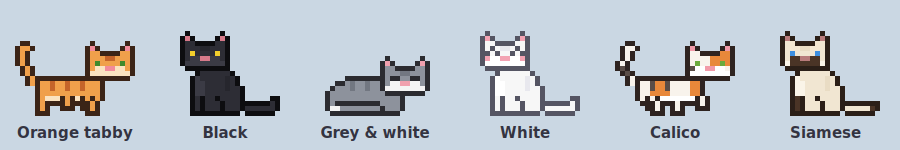
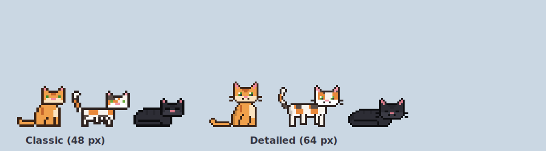
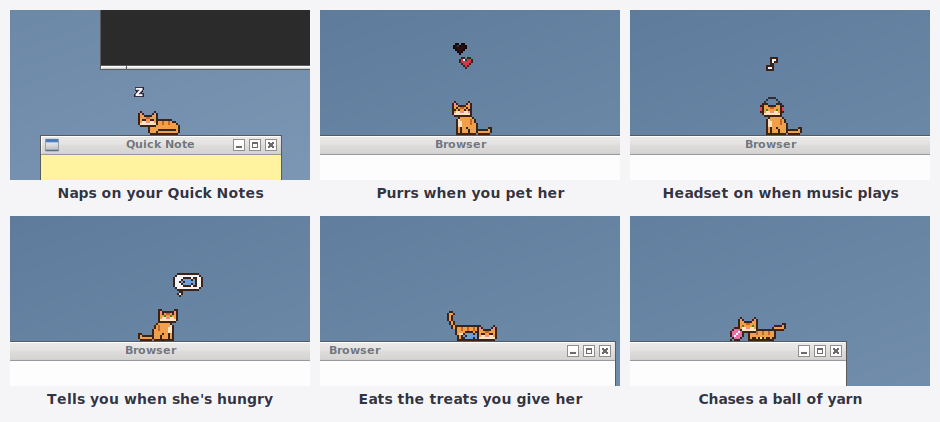
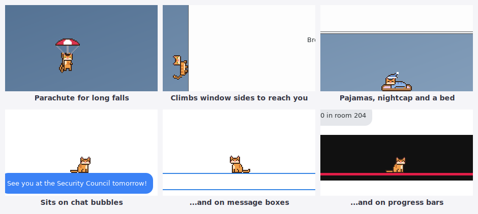
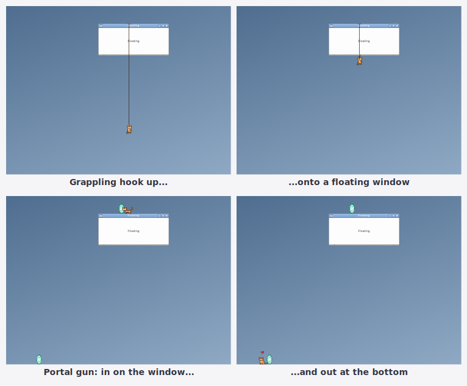
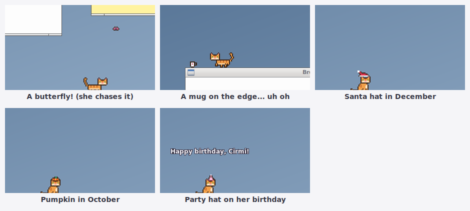
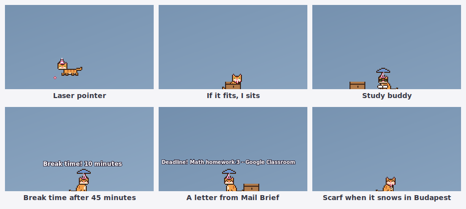

# Pixel Cat

A little pixel-art cat that lives on your desktop. She walks along the tops of your
windows, naps on them, jumps from one to another, climbs up the edges of the screen,
chases your mouse, and purrs when you pet her. When music plays she puts on a tiny
headset and bobs her head.















## Install

```bash
cd pixel-cat
./install.sh
```

The first time, a small window opens. Pick her style (**Classic**, about 48 px, or
**Detailed**, about 64 px with bigger shiny eyes, whiskers and shading), her coat (orange
tabby, black, grey & white, white, calico or siamese) and give her a name. Then she drops onto your desktop.

The installer also:
- starts her automatically when you log in
- adds **Pixel Cat** to the menu (opening it while she's running calls her to your mouse)
- sets up **Ctrl+Alt+C** to call her. If that's taken, she picks the next free one; the
  installer tells you which (also `pixel-cat --shortcut`)

Bigger or smaller cat: `SIZE=3 ./install.sh` (1 = small, 2 = normal, about 48 px, 3 = big).
Uninstall with `./uninstall.sh` (add `--forget` to also forget her name and mood).

## Living with her

| You do | She does |
|---|---|
| Rub the mouse back and forth over her | purrs, closes her eyes, and pixel hearts float up |
| Click her | a heart |
| Drag her | dangles from your pointer; let go (or throw her) and she lands on her feet |
| Move a window she's sitting on | rides along, smoothly |
| Close or minimize that window | falls and lands on whatever is below |
| **Ctrl+Alt+C** | comes to your mouse: she runs, jumps from window to window and climbs up window sides to get there. A window floating high up? Out comes her **grappling hook**. Far away or no way by paw? She opens two **portals** and walks through |
| Right-click her | her mood and needs (and Budapest's weather), **Give a treat**, **Play** (yarn, laser pointer, cardboard box), **Call her here**, **Send her to bed**, **Take a photo**, **her diary**, **Settings**, change style, coat or name |
| Play music (Spotify or anything else) | puts on a headset, bobs her head, little music notes |
| Watch a video or give a presentation in fullscreen | hides until you're done |

When she falls from high up (a closed window, a throw, a drop from the top of the screen)
she opens a little **parachute** and floats down. For smaller drops a **trampoline** pops up
under her and she bounces once or twice before landing.

On her own she walks around, sits, grooms, yawns and naps (more at night and more when
she's tired), jumps between windows, walks along the panel, and sometimes climbs up the
side of the screen and walks upside down along the top before dropping down. Now and then
she goes on an **adventure** to another spot on the screen, using her grappling hook or a
portal when that's the way to get there. She's a cat, so every so often she **slips** off an
edge, misses a jump or rolls off a window in her sleep (don't worry: parachute or trampoline). If your
mouse is near her, she may crouch, wiggle, and pounce on it. Her favourite nap spot is a
Quick Notes post-it.

## Little surprises

- **Butterflies:** now and then a pink butterfly flutters in. She runs after it, crouches,
  wiggles and leaps, and it always gets away. Sometimes, after a while, it lands on her head
  instead, and she sits very still and very happy.
- **The mug:** sometimes a little mug appears near the edge of the window she's on. She
  walks up to it, gives you a look, taps it... and pushes it off. It breaks at the bottom.
- **Seasonal hats:** a pumpkin all October, a Santa hat all December, and a party hat with
  confetti and a birthday wish on her "adoption birthday" (the day you first picked her).
  Turn hats off with right-click > **Seasonal hats**.

## Playing

- **Laser pointer:** right-click > Play > Laser pointer. A red dot follows your mouse and she
  goes wild: runs after it, jumps to other windows for it, pounces when it's above her. It
  switches itself off after a minute (or pick "Stop the laser pointer").
- **Cardboard box:** right-click > Play > Cardboard box. She *has* to get in: only her head
  sticks out, and sometimes she falls asleep in it.

## Study buddy

When you've been working for a while she studies along: tiny glasses and a little book.
After **45 minutes** without a break she comes over to your mouse, meows, and says
"Break time! 10 minutes". If you keep going she reminds you again 5 minutes later (at most
three times). A break of 10 minutes starts a new round. Turn it off in right-click > Settings.

## When you're away

If you don't touch the mouse or keyboard for 3 minutes, she walks to the middle of the
screen and naps. When you come back she wakes up, stretches, and says hi.

## Weather (Budapest)

She checks Budapest's weather every 30 minutes (open-meteo.com, free, no account; only
Budapest's location is sent). When it rains she carries a little umbrella; when it snows she
wears a scarf. The right-click menu shows the current weather. Turn it off in Settings.

## Letters from Mail Brief

If Mail Brief is installed, an important email or a deadline makes her bring you a tiny
envelope: she comes to your mouse and shows who it's from and what it's about.

## Photos and her diary

- **Take a photo:** she poses, the screen flashes, and a polaroid with her name and the date
  is saved in `Pictures/Pixel Cat`.
- **Her diary:** how many days you've been together, hearts, treats, yarn games, laser
  chases, boxes, butterflies, mugs, grappling hooks, portals, letters, breaks and photos.

## Bedtime

Right-click > **Send her to bed** (it says "it's late!" in the evening). She puts on her
pajamas and a nightcap, a little bed appears in the bottom-left corner of the screen, and
she makes her way there, climbs in and sleeps. Pet her in bed and she purrs in her sleep.

- At night she sleeps until 7:00 in the morning, even if you shut the laptop down; during
  the day it's a 45-minute nap.
- Right-click > **Wake her up**, press Ctrl+Alt+C, or pick her up to wake her earlier.

## Exploring inside windows

She also uses long lines inside your windows as little shelves: the top of a message box
(Claude, Messenger), chat bubbles, a video's progress bar, toolbars. She doesn't know what
they are; every 5 seconds she looks at the screen for long, clean horizontal lines. When
the page scrolls and her line moves away, she falls (with her parachute if it's high).

Turn it off with right-click > **Explore inside windows** if you'd rather she stays on top
of the windows. Looking at the screen is done locally; nothing is saved or sent anywhere.

## Her needs

She gets hungry, bored and sleepy over time, and she likes attention.

- **Hungry:** she meows and shows a thought bubble with a fish. Give her a treat from the
  right-click menu and she runs over to eat it.
- **Bored:** a thought bubble with a ball of yarn. **Play with yarn** and she chases and
  bats it around.
- **Sleepy:** she naps and wakes up by herself.
- **Ignored for a long time:** her ears go flat and she looks a bit sad until you pet or
  feed her.

It's gentle: she never gets sick or runs away, and her needs pause while the app isn't
running.

## Sounds

A quiet purr while you pet her and an occasional soft meow when she wants something.
Turn them off with right-click > **Sounds**.

## Settings

`~/.config/pixel-cat/settings.ini`:

```ini
[pixel-cat]
shortcut=<Primary><Alt>c     # none = no shortcut
size=2                       # 1 small, 2 normal, 3 big
```

Restart her after changing it (`pixel-cat --quit`, then start Pixel Cat from the menu).

## Notes

- She needs an X11 desktop (Linux Mint Cinnamon, MATE or Xfce). On Wayland she can't see
  or sit on your windows.
- Windows are found with Wnck (`gir1.2-wnck-3.0`); the installer adds it if it's missing.
- In testing she used about 3% of one CPU core (a little more with exploring on, on a
  slower laptop).
- Her name and mood are saved in `~/.local/share/pixel-cat/cat.json`.

## Requirements

Python 3 with GTK 3, cairo and Wnck (`python3-gi`, `python3-gi-cairo`, `gir1.2-gtk-3.0`,
`gir1.2-wnck-3.0`), and `paplay` for sounds. Linux Mint has everything except possibly
Wnck, which the installer adds.
