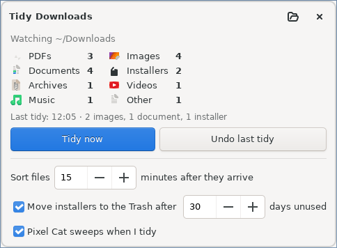

# Tidy Downloads

Keeps your Downloads folder in order by itself. Fifteen minutes after a download has
finished, it goes into a folder by type inside Downloads. Old installers you don't need any
more go to the Trash after 30 days. Everything can be undone.



## Install

```bash
cd tidy-downloads
./install.sh
```

The first time it asks whether to also tidy the files that are **already** in your
Downloads folder (you can undo that too). It starts automatically when you log in.

## What goes where

| Folder (inside Downloads) | Files |
|---|---|
| PDFs | .pdf |
| Images | .png .jpg .jpeg .gif .webp .heic .svg ... |
| Documents | Word, PowerPoint, Excel, LibreOffice, .txt, .csv, .epub ... |
| Installers | .deb .AppImage .run .flatpakref .iso .exe ... |
| Archives | .zip .rar .7z .tar.gz ... |
| Videos | .mp4 .mkv .webm .mov ... |
| Music | .mp3 .wav .flac .ogg ... |
| Other | anything else |

- Files wait **15 minutes** first, so the download list in your browser still works right
  after a download (clicking a moved file there would fail).
- Unfinished downloads (`.crdownload`, `.part` ...), hidden files and your own folders
  are never touched.
- If a file with the same name is already in the folder, both are kept
  (`worksheet (2).pdf`). Nothing is ever overwritten.

## Clearing old installers

Installers you haven't opened for **30 days** are moved to the **Trash**, not deleted, so
you can still get them back. PDFs, documents, images and everything else are never cleared.

## Undo and control

- Every tidy shows a notification with an **Undo** button.
- Open **Tidy Downloads** from the menu: how many files are in each folder, the last tidy,
  **Tidy now**, **Undo last tidy**, and the settings (the waiting time, the installer clean-up).
- Right-click in the file manager > **Tidy Downloads now**.
- From a terminal: `tidy-downloads --now`, `tidy-downloads --undo`.

## Pixel Cat

If Pixel Cat is installed, she comes out with a tiny broom, sweeps for a moment and tells
you how many files were tidied. Turn it off in the window.

## Notes

- Works with a translated Downloads folder too (for example `Letöltések`).
- Uninstall with `./uninstall.sh`; your sorted files stay where they are.

## Requirements

Python 3 with GTK 3 (`python3-gi`, `gir1.2-gtk-3.0`), preinstalled on Linux Mint.
